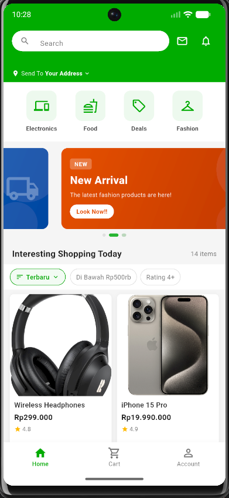
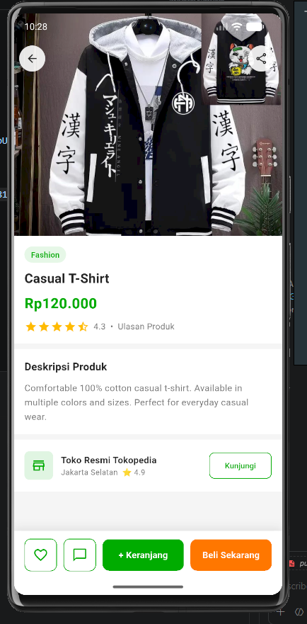
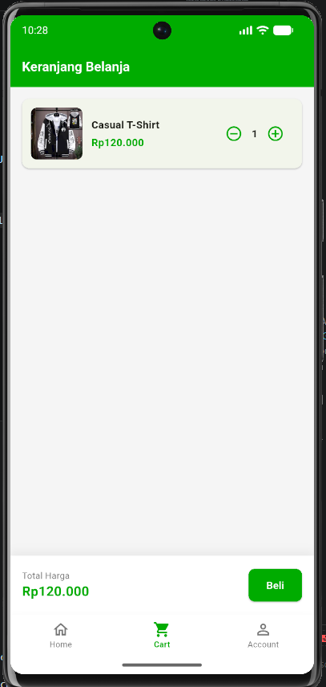
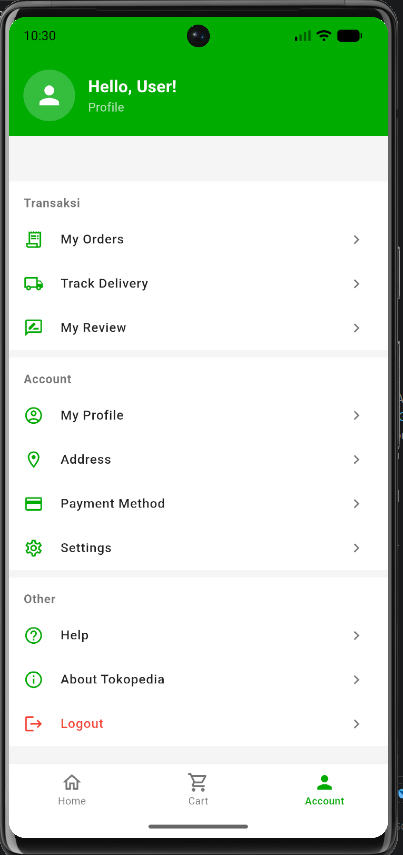

# 🛍️ Tokopedia Clone - Flutter UI

<p align="center">
  
  
  
  
</p>

<p align="center">
  Aplikasi mobile clone Tokopedia yang dibangun menggunakan Flutter. Proyek ini merupakan implementasi front-end UI yang meniru tampilan dan nuansa aplikasi e-commerce Tokopedia.
</p>

---

## 📱 Screenshots

> *Tambahkan screenshot aplikasi kamu di sini*

| Home Screen | Detail Produk | Keranjang | Akun |
|:-----------:|:-------------:|:---------:|:----:|
|  |  |  |  |

---

## ✨ Fitur

- 🔍 **Search Bar** — Pencarian produk real-time
- 🎠 **Banner Promo** — Slider otomatis dengan 3 banner promosi
- 📂 **Filter Kategori** — Electronics, Food, Deals, Fashion
- 🔃 **Sort & Filter** — Urutkan berdasarkan harga, rating, atau terbaru
- 🛒 **Keranjang Fungsional** — Tambah, hapus, ubah kuantitas produk
- ❤️ **Wishlist** — Simpan produk favorit
- 📦 **Detail Produk** — Halaman lengkap dengan deskripsi dan info toko
- 🧭 **Bottom Navigation** — Home, Cart, Account

---

## 🗂️ Struktur Proyek

```
lib/
├── main.dart
├── models/
│   ├── product.dart          # Model & data produk
│   ├── app_theme.dart        # Warna & style global
│   └── cart_provider.dart    # State management cart & wishlist
├── screens/
│   ├── home_screen.dart
│   ├── product_detail_screen.dart
│   ├── cart_screen.dart
│   └── account_screen.dart
└── widgets/
    ├── product_card.dart
    ├── category_item.dart
    ├── promo_banner.dart
    └── sort_filter_bar.dart
```

---

## 🚀 Cara Menjalankan

### Prerequisites
- Flutter SDK `>=3.0.0`
- Android Studio / VS Code
- Android Emulator atau device fisik

### Langkah-langkah

```bash
# 1. Clone repositori
git clone https://github.com/CUKLIZ/Tokopedia-Clone-Flutter.git

# 2. Masuk ke direktori proyek
cd Tokopedia-Clone-Flutter

# 3. Install dependencies
flutter pub get

# 4. Jalankan aplikasi
flutter run
```

> **Catatan:** Taruh gambar produk di folder `assets/images/` dengan nama:
> `headphones.jpg`, `iphone.jpg`, `sneakers.jpg`, `avocado.jpg`, `smartwatch.jpg`, `tshirt.jpg`

---

## 🧰 Tech Stack

| Teknologi | Kegunaan |
|-----------|----------|
| Flutter | UI Framework |
| Dart | Bahasa Pemrograman |
| `intl` | Format harga Rupiah |
| `ChangeNotifier` | State management cart & wishlist |

---

## 📦 Dependencies

```yaml
dependencies:
  flutter:
    sdk: flutter
  intl: ^0.19.0
```

---

## 🎨 Design System

| Elemen | Nilai |
|--------|-------|
| Primary Color | `#03AC0E` (Hijau Tokopedia) |
| Accent Color | `#FF7700` (Oranye) |
| Star Color | `#FFBB00` (Kuning) |
| Font | Roboto |

---

## 👤 Author

**CUKLIZ**
- GitHub: [@CUKLIZ](https://github.com/CUKLIZ)

---

## 📄 Lisensi

Proyek ini dibuat untuk keperluan sertifikasi front-end. Tidak berafiliasi dengan Tokopedia / GoTo Group.
